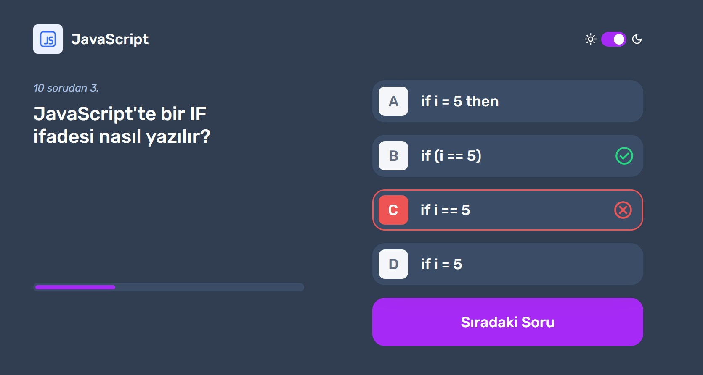

# Frontend Quiz Uygulaması

Bu proje, frontend geliştirme konularında (HTML, CSS, JavaScript) bilginizi test edebileceğiniz interaktif bir quiz uygulamasıdır.



## Özellikler

- 🌓 Karanlık/Aydınlık mod desteği
- 📱 Responsive tasarım
- 🎯 Anlık skor takibi
- 🔄 Sınav sonunda yeniden başlatma özelliği
- 💾 Tema tercihi yerel depolamada saklanır

## Teknolojiler

- **React** (v18.3.1) - Kullanıcı arayüzü geliştirme
- **Vite** (v6.0.5) - Hızlı geliştirme ortamı ve build aracı
- **ESLint** (v9.17.0) - Kod kalitesi ve standartları

## Proje Yapısı

```
quiz-app-react/
├── public/
│   ├── data/
│   │   └── data.json       # Quiz soruları ve cevapları
│   └── svg/                # İkon ve görseller
├── src/
│   ├── App.jsx            # Ana uygulama bileşeni
│   ├── App.css            # Ana stil dosyası
│   ├── Svg.jsx            # SVG bileşenleri
│   ├── dark-mode.css      # Karanlık mod stilleri
│   ├── reset.css          # CSS reset
│   └── main.jsx           # Uygulama giriş noktası
└── package.json           # Bağımlılıklar ve scripts
```

## Kurulum

1. Projeyi klonlayın:

```bash
git clone https://github.com/MrDemirtas/quiz-app-react.git
cd quiz-app-react
```

2. Bağımlılıkları yükleyin:

```bash
npm install
```

3. Geliştirme sunucusunu başlatın:

```bash
npm run dev
```

## Kullanım

1. Ana sayfada test etmek istediğiniz konu başlığını seçin (HTML, CSS, JavaScript)
2. Her soru için doğru olduğunu düşündüğünüz cevabı işaretleyin
3. "Cevabı Onayla" butonuna tıklayın
4. Doğru/yanlış durumunu kontrol edin ve "Sıradaki Soru" butonu ile devam edin
5. Quiz sonunda toplam skorunuzu görüntüleyin

## Geliştirme

- `npm run dev` - Geliştirme sunucusunu başlatır
- `npm run build` - Üretim için build oluşturur
- `npm run preview` - Build çıktısını önizler
- `npm run lint` - ESLint ile kod kontrolü yapar
